# 2025年十三款最佳AI招聘自动化软件完整榜单(深度整理)

招聘最头疼的是什么?每天收到几百份简历但没时间逐一筛选、优秀候选人在面试安排环节流失、团队协作时信息散落在各种邮件和表格里找不到重点。传统招聘流程耗时又费力,人工处理每个环节效率低下,错过好候选人是常态。现在有一批AI驱动的招聘自动化系统,能帮你自动筛选简历、智能匹配岗位、自动安排面试、实时同步候选人状态,把招聘流程效率提升3-5倍。这份榜单整理了13个值得关注的AI招聘和ATS平台,从初创公司到大型企业、从基础功能到高级AI助手,覆盖各种规模和预算的招聘需求。

## **[Mega HR](https://megahr.com)**

AI招聘管理助手Megan,自动化78%的招聘流程。

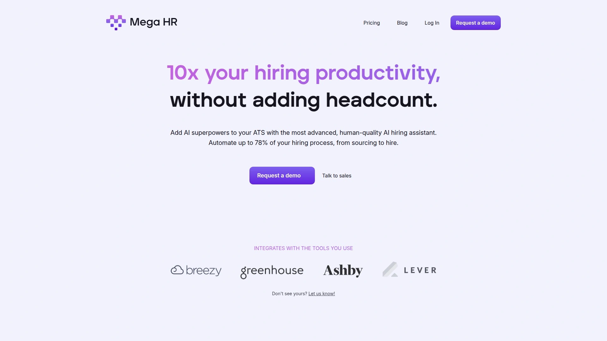

Mega HR最大的卖点是能自动化高达78%的招聘工作,从寻源到最终雇佣全流程覆盖。核心是名叫Megan的AI招聘经理助手,它不是简单的聊天机器人,而是真正能理解岗位需求、评估候选人资质、做出招聘决策的智能系统。这个"人类级别"的AI能力让它和市面上那些只会关键词匹配的工具完全不在一个层次。

候选人筛选功能特别强大,可以大规模处理新申请者但不牺牲精确度和细节。你设置具体标准(包括那些没写在岗位描述上的隐性要求),Megan会自动识别最佳选项。这种深度筛选能力意味着人工只需要看那些真正合格的候选人,不用再浪费时间在明显不匹配的简历上。

面试安排完全自动化,支持自定义安排链接和Google、Microsoft日历完全同步。你可以自己管理、分享链接给候选人、或者直接让Megan搞定整个流程。Megan会记录面试笔记、总结面试内容、分享她的洞察,让你能专注于对话和了解候选人本身,而不是埋头记笔记。

所有数据在ATS和Mega之间实时同步——岗位、候选人、阶段、面试、笔记全都自动更新。永远不需要重复输入数据,这个无缝集成能节省大量时间。AI偏见分析集成了第三方工具,监测年龄、性别、种族、残疾、性别认同、性取向、宗教、政治倾向等维度,确保招聘过程公平包容。

特别适合需要处理大量申请、招聘流程复杂、或者招聘团队人手不足的成长型公司和企业。如果你的招聘瓶颈在简历筛选和面试安排这些重复性工作上,Megan能立刻解放你的时间。

## **[Greenhouse](https://www.greenhouse.io)**

结构化招聘领导者,强大的集成能力和可扩展性。

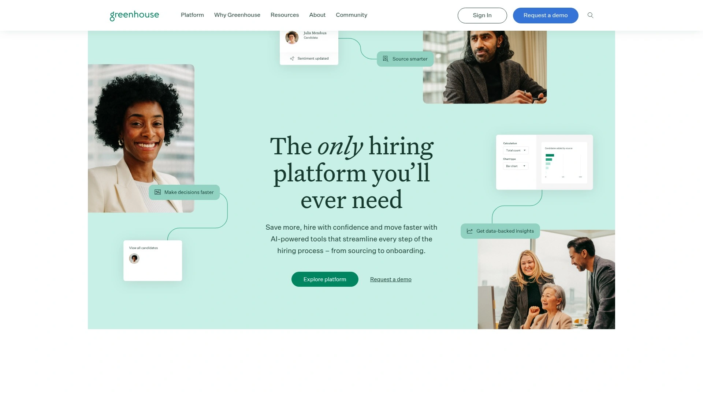

Greenhouse是企业级ATS的行业标杆,特别擅长结构化招聘流程设计。它不只是追踪候选人,而是帮你建立一套标准化、可重复、可衡量的招聘体系。这种结构化方法对需要保证招聘质量和一致性的大型组织特别重要。

集成生态系统是Greenhouse的最大优势,和几百个第三方工具无缝连接。开放API让技术团队可以深度定制,满足复杂的业务需求。这种广泛的集成能力意味着Greenhouse可以成为你整个人才获取技术栈的中心枢纽。

面试调度功能特别先进,支持一对一、小组、多阶段面试的自动安排。智能面试官匹配和负载平衡确保面试工作均匀分配,不会让某些人过载。面试官培训和认证追踪功能帮你维护面试质量标准。

DEI(多元、平等、包容)、流程管线、容量分析这些高级分析功能提供深度洞察。可以追踪从哪个渠道来的候选人质量最高、哪个阶段流失率最大、不同面试官的评分差异。报告功能非常强大,能生成任何你想要的招聘数据。

用户界面设计直观,新人上手快。虽然功能复杂但不会让人觉得overwhelm。客服支持响应快,满意度高。定价偏高,更适合中大型企业或者快速成长的科技公司。特别适合重视流程标准化、需要强大集成能力、愿意为顶级ATS投资的组织。

## **[Lever](https://www.lever.co)**

ATS和CRM一体化解决方案,候选人关系管理专家。

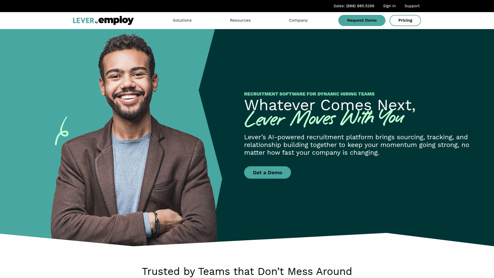

Lever的独特之处在于它把ATS和CRM(候选人关系管理)功能融合在一起。大多数ATS只管理已经申请的候选人,Lever还帮你管理那些还在培养中的潜在候选人。这种一体化设计特别适合需要主动寻源和建立人才库的招聘团队。

自动化工作流是Lever的核心优势,可以设置各种触发器简化重复性任务。比如候选人进入某个阶段自动发送邮件、面试完成自动提醒团队打分、offer发出自动启动背景调查。这些自动化让招聘流程像流水线一样顺畅运转。

面试调度工具智能匹配面试官,考虑他们的可用时间、专业领域、工作负载。候选人反馈调查自动发送,收集体验数据帮你改进流程。这种对候选人体验的重视在ATS里不常见。

高级自动化功能可以处理复杂的招聘场景,比如跨时区的全球招聘、多轮技术面试的安排、远程和现场混合面试。Kanban看板界面让候选人流动一目了然,拖拽操作改变阶段。

定价根据公司规模和功能需求定制。被定位为中型组织的顶级选择,介于小企业工具和超大型企业系统之间。特别适合需要主动寻源、建立人才库、重视候选人关系管理的科技公司和快速成长的企业。

## **[BambooHR](https://www.bamboohr.com)**

HRIS加ATS的全能HR平台,小企业的理想选择。

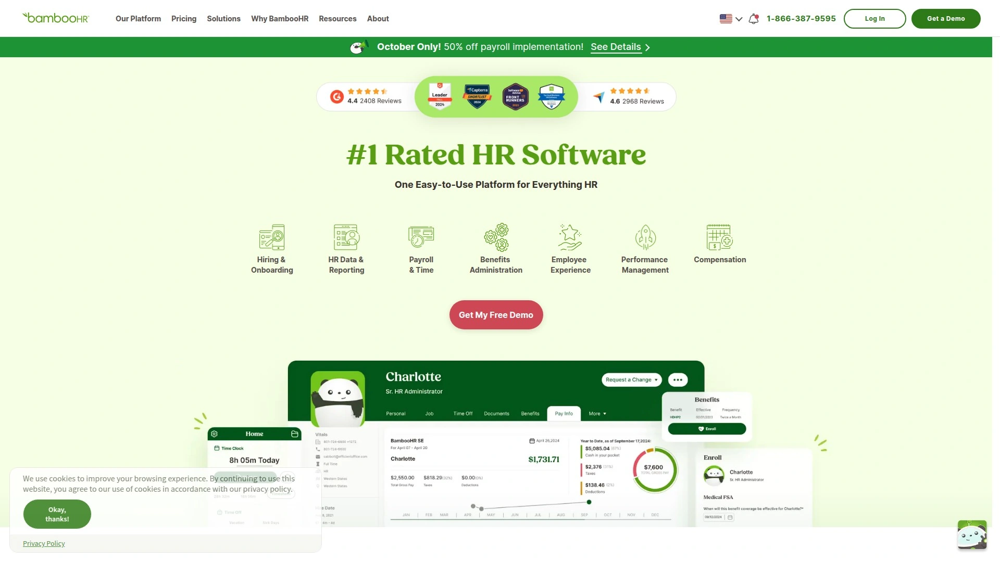

BambooHR本质上是一个全面的人力资源信息系统(HRIS),招聘只是它众多功能中的一个模块。这种设计意味着你用一个平台就能管理从招聘到入职到员工管理的整个人力资源生命周期。对小型企业来说,这种一体化方案比分散购买多个系统更经济。

易用性是BambooHR最大的优势,在G2上用户体验得分9.2,比Greenhouse的8.5高不少。界面设计非常直观,不需要太多培训HR团队就能上手。这对没有专职IT支持的小公司特别重要。

虽然ATS功能相对简单,但对很多小企业来说够用了。可以发布岗位、追踪候选人、安排面试、收集反馈。如果你的招聘需求不是特别复杂,BambooHR的基础ATS功能完全能满足。

真正的价值在于它和HRIS其他模块的深度集成。候选人一旦被录用,信息自动转到员工档案系统,开始入职流程、设置薪资、分配福利。这种无缝转换消除了招聘和员工管理之间的信息断层。

定价比纯ATS系统贵,但考虑到你得到的是完整HRIS功能,性价比很高。报价制定价模式可以根据公司规模和需求定制。特别适合50-500人的小中型企业、需要全面HR解决方案、招聘需求相对简单的公司。不适合招聘流程特别复杂或者需要高级ATS功能的大型企业。

## **[Paradox AI(Olivia)](https://www.paradox.ai)**

对话式AI招聘助手,全天候候选人服务体验。

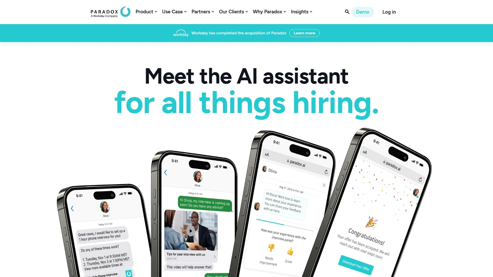

Paradox的核心是名叫Olivia的AI虚拟助手,她用对话方式处理招聘的各个环节。不是那种只会回答FAQ的简单聊天机器人,而是能理解自然语言、主动推进流程、做出决策的智能助手。这种对话式体验让招聘变得像聊天一样简单。

候选人体验是Paradox的最大卖点,99.78%的候选人对体验给出正面评价。Olivia 24小时在线,随时回答问题、更新状态、安排面试。对候选人来说就像有个专门的招聘顾问一直在帮忙。这种即时响应能让候选人转化率提升5倍。

简历筛选和匹配功能用AI评估候选人是否符合岗位要求。面试调度完全自动化,Olivia会找到双方都合适的时间,发送邀请,处理重新安排的请求。员工推荐管理功能鼓励内部员工推荐候选人。

数据分析和报告工具追踪关键招聘指标。能看到Olivia处理了多少对话、节省了多少人工时间、候选人满意度如何。已经为全球500多家公司服务,每年节省数百万小时的人工工作。

特别适合高容量招聘场景,比如零售、餐饮、物流这些需要快速雇佣大量员工的行业。候选人体验和速度比复杂功能更重要的场景也很合适。现在已经成为SAP认可的应用,在SAP Store上架。不适合需要高度定制化招聘流程的复杂企业。

## **[Workable](https://www.workable.com)**

全功能现代ATS,AI候选人寻源和协作招聘。

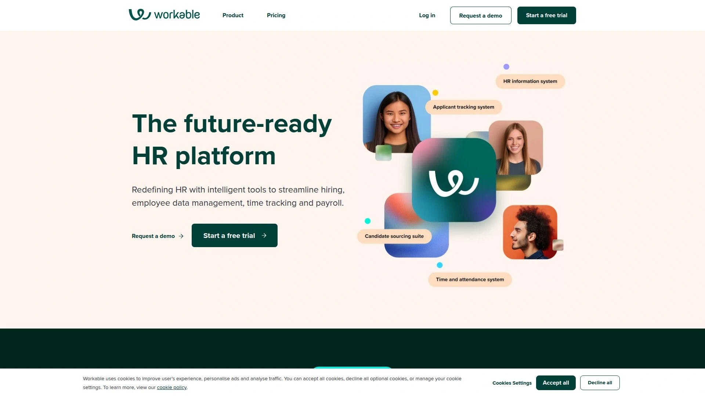

Workable定位是现代化的全栈招聘平台,覆盖从岗位发布到入职的完整流程。界面设计现代友好,操作逻辑符合直觉。这种易用性让它在小型到中型团队中很受欢迎。

AI候选人寻源工具是Workable的特色功能,主动帮你找到被动求职者。不只是等候选人来申请,系统会扫描各种人才库和社交平台,推荐潜在匹配。这种主动寻源能力让你接触到更广泛的人才池。

岗位发布和分发功能一键同步到200多个招聘网站和社交媒体平台。大幅增加岗位曝光度,吸引更多候选人。协作招聘界面让团队成员能轻松分享评论、打分、讨论候选人。

自动化工作流和调度功能简化重复性任务。可定制的招聘管线让你根据自己的流程设计阶段。综合报告工具提供实时招聘数据,帮你做数据驱动的决策。

视频面试功能内置,不需要第三方工具。移动应用让招聘经理能随时随地审阅候选人和批准决策。定价比Breezy HR高但提供更多功能,适合需要全面解决方案的成长型团队。特别适合需要主动寻源、重视团队协作、追求现代化招聘体验的中型企业。

## **[Manatal](https://www.manatal.com)**

AI驱动的招聘平台,社交媒体富化和候选人推荐。

Manatal用AI和机器学习技术彻底改变招聘流程。它的独特功能是候选人社交媒体富化——自动从LinkedIn、Facebook、Twitter等平台抓取信息,完善候选人档案。这种自动化数据收集能让你更全面了解候选人,不只是看简历上写的。

AI推荐引擎会根据岗位要求自动匹配最合适的候选人。机器学习算法会从你过去的招聘决策中学习,越用越智能。简历解析和数据提取功能自动从简历中提取关键信息填充字段。

寻源和候选人管理功能覆盖从找人到雇佣的全过程。协作和沟通工具让团队成员能无缝配合。申请人追踪系统(ATS)功能完整,Kanban看板拖拽操作很直观。

高级分析和报告仪表板提供深度洞察。能看到各个招聘渠道的效果、候选人来源质量、招聘周期瓶颈在哪。自动化和AI功能减少手动工作,提升效率。

定价从每月15美元起,提供15天免费试用。性价比在AI招聘平台里算很高。特别适合需要AI智能匹配、重视候选人数据完整性、或者招聘渠道分散的中小型企业和招聘代理。

## **[Zoho Recruit](https://www.zoho.com/recruit)**

端到端招聘自动化,支持内部HR和招聘代理。

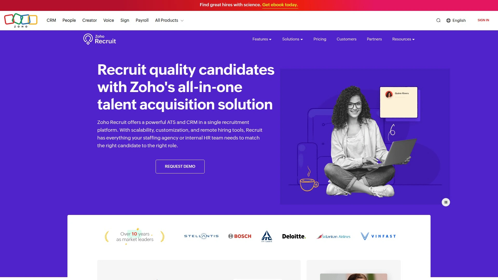

Zoho Recruit是个全面的招聘自动化平台,既支持企业内部HR团队也支持招聘代理公司。这种双重定位让它的功能特别灵活,能适应不同的业务模式。从寻源到入职的端到端自动化让招聘更智能、更快、更有组织。

可定制工作流是Zoho的核心优势,几乎每个环节都能根据需求调整。不像某些系统强制你适应它的流程,Zoho让你自己定义流程。简历解析和匹配功能自动提取候选人信息并评分。

多渠道岗位发布一键同步到各大招聘网站。高级搜索和过滤功能帮你从大量候选人中快速找到目标。客户和候选人门户让外部用户能自助查看状态和提交信息。

详细的分析和仪表板提供实时招聘数据。和Zoho其他产品(CRM、邮件、办公套件)深度集成,如果你已经在用Zoho生态系统,整合会非常顺畅。也支持和其他主流工具集成。

定价灵活,有免费版和多个付费层级,适应不同规模需求。特别适合招聘代理公司、需要高度定制流程、或者已经在用Zoho产品的企业。功能丰富但学习曲线中等,需要花时间设置和定制。

## **[Breezy HR](https://breezy.hr)**

拖拽式招聘管线,小团队的简单易用之选。

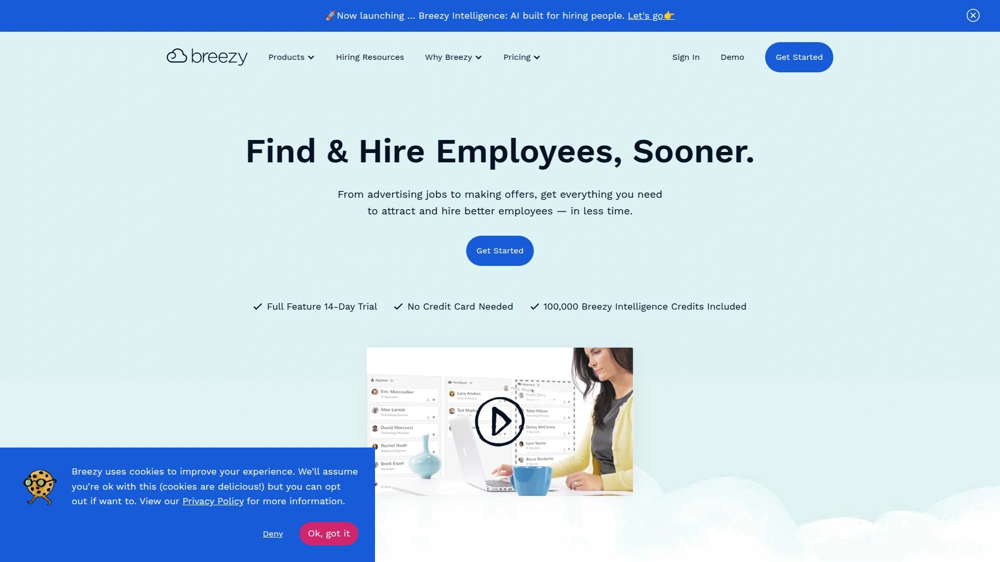

Breezy HR的设计理念是让招聘变得轻松愉快,界面简洁直观。拖拽式Kanban看板让你像玩Trello一样管理候选人,拖动卡片就能改变阶段。这种视觉化管理方式对小型团队特别友好。

自动化功能覆盖候选人预筛选、邮件发送、面试安排、团队反馈收集。虽然不如企业级ATS那么复杂,但常用的自动化都有。团队协作工具让成员能轻松分享评论和打分。

品牌化招聘页面功能可以创建自定义的职业网站,展示公司文化和开放岗位。候选人可以直接在你的网站申请,而不只是通过招聘网站。邮件和短信通信工具内置,方便和候选人互动。

定价透明,从每月143美元起,提供14天免费试用。比Workable便宜但功能相对简单。没有隐藏费用,适合预算有限的小团队。

特别适合50人以下的小型企业、初创公司、或者刚开始建立正式招聘流程的团队。如果你需要的是简单易用而不是复杂功能,Breezy的性价比很高。不适合需要高级寻源工具或者复杂工作流的大型组织。

## **[Juicebox AI](https://juicebox.ai)**

800M+人才档案的AI语义搜索,全自动外展序列。

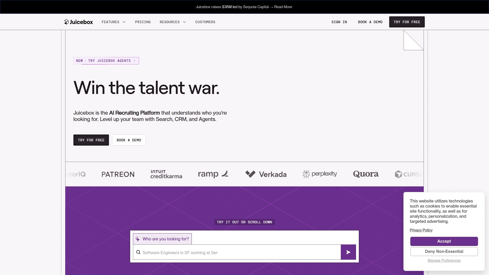

Juicebox把AI招聘提升到新高度,它不是帮你管理已有候选人,而是主动帮你找到候选人。PeopleGPT是它的AI搜索引擎,能搜索8亿多个人才档案。你只需要用自然语言描述需求,AI就会从多个数据源中找到匹配的人。

自动化个性化外展序列是杀手级功能。Juicebox不只是找到候选人,还会自动发送个性化消息、跟进、管理对话。整个寻源和初步接触过程完全自动化,招聘人员只需要处理那些回复感兴趣的候选人。

候选人评分和相关性排名功能确保你先看到最匹配的人。一键导出到ATS功能让数据同步毫不费力。这种设计让Juicebox像个全职寻源专员在后台不停工作。

特别适合需要大规模寻源、招聘量大、或者难以填补的专业岗位。无论是招一个工程师还是100个销售,Juicebox都能扩展应对。定价需要联系获取,针对不同规模定制。不适合只需要管理已有申请者、不需要主动寻源的场景。

## **[HireVue](https://www.hirevue.com)**

视频面试和AI评估专家,高容量招聘的标准选择。

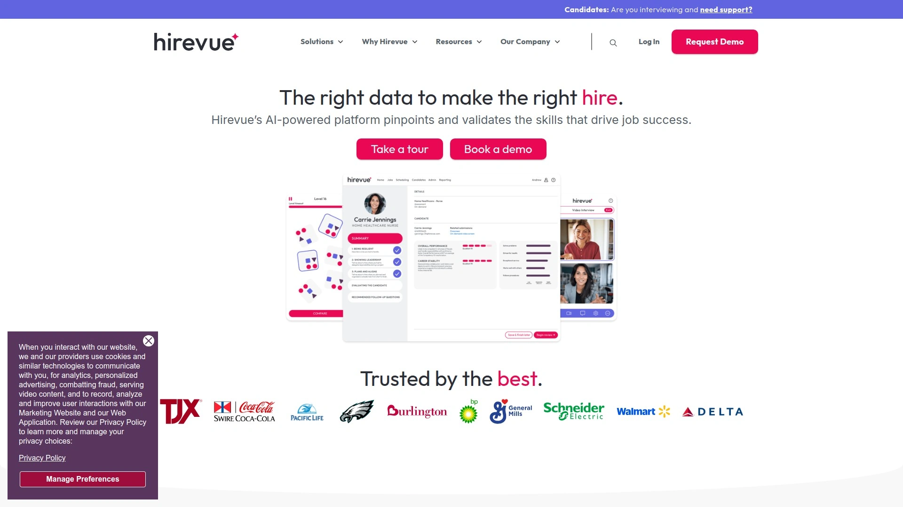

HireVue是企业级AI招聘和视频面试平台,专门为简化高容量招聘流程设计。它的视频面试功能特别强大,支持预录和实时两种模式。候选人可以在方便的时间录制回答,或者参加实时视频面试。

预测性评估功能用AI评估候选人的能力并预测工作表现。这种数据驱动的方法比传统面试更客观,能减少偏见。结构化面试工具提供标准化的面试指南,确保一致性。

游戏化评估是HireVue的创新功能,通过互动游戏测试候选人的认知能力和性格特征。这种方式比传统测试更有趣,候选人参与度更高。AI分析候选人在游戏中的表现,预测他们在岗位上的潜力。

大型企业招聘几百上千人时,HireVue能确保流程标准化和高效。财富500强公司很多在用,经过大规模验证。定价偏高,更适合大企业或者高容量招聘场景。特别适合需要快速筛选大量候选人、重视评估科学性、或者远程招聘为主的大型组织。

## **[Lindy AI](https://www.lindy.ai)**

无代码AI招聘代理构建平台,自定义自动化任务。

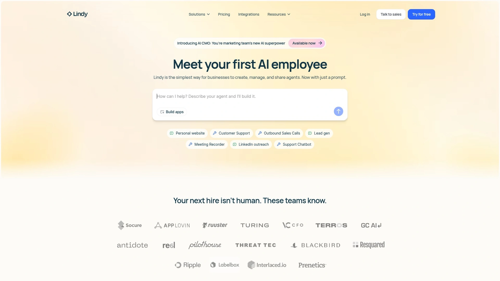

Lindy是个无代码平台,让你能创建自定义AI招聘代理自动执行各种任务。不需要懂编程,用拖拽方式就能设计自动化流程。这种灵活性让初创公司和招聘公司能在不增加人员的情况下自动化招聘工作。

候选人研究代理可以自动搜集候选人背景信息。候选人筛选代理根据预定义标准评估简历,筛选出最合格的候选人。邮件起草和跟进代理能撰写、个性化、发送外展邮件、面试邀请、候选人跟进。

面试安排和录制功能最小化人工干预,合法的地方还能自动录制面试。所有这些代理可以串联起来,形成完整的自动化招聘流水线。你定义规则和流程,AI代理执行具体工作。

免费版可以自动化最多400个任务,付费版从每月49.99美元起,提供最多5000次月度任务自动化。这个定价对需要大规模自动化的团队来说性价比很高。特别适合技术导向的团队、需要高度定制自动化、或者想用一个平台处理多种招聘任务的公司。

## **[Fetcher](https://www.fetcher.ai)**

AI驱动的被动候选人寻源,专注难招岗位。

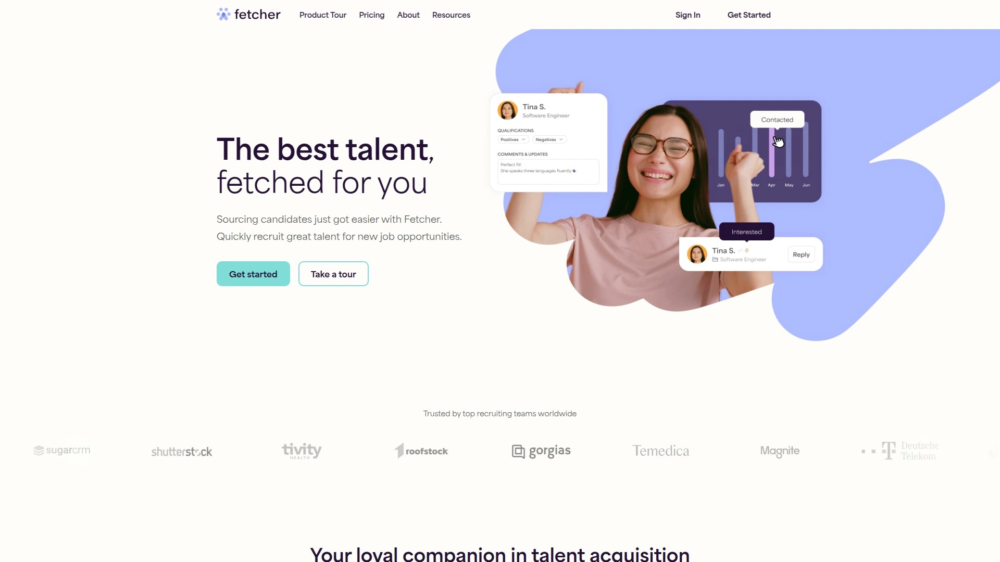

Fetcher专注解决一个痛点——找到那些没在主动找工作但可能感兴趣换机会的被动候选人。它的AI会持续搜索和评估潜在候选人,每周向你推荐最匹配的人。这种主动寻源方式特别适合难以填补的专业技术岗位。

自动化外展功能会代表你联系候选人,发送个性化消息介绍机会。AI学习哪种消息风格回复率最高,不断优化沟通策略。候选人画像功能让你定义理想候选人的特征,AI据此寻找。

多样性招聘是Fetcher的重点功能之一,系统特别注意推荐来自不同背景的候选人。这帮助企业建立更多元化的团队。和主流ATS集成,找到的候选人可以直接导入现有系统。

定价基于订阅制,根据岗位数量和寻源需求定制。适合有预算投资主动寻源、招聘难度大的技术岗位、或者重视多样性招聘的科技公司。不适合只需要管理已有申请者的场景,因为Fetcher的价值在主动寻源。

## FAQ常见问题

**AI招聘软件真的能替代人工招聘吗?**

不能完全替代,但能自动化大部分重复性工作。AI擅长简历筛选、初步匹配、面试安排、数据分析这些标准化任务,能节省招聘人员70-80%的时间。但最终的雇佣决策、文化契合度评估、薪资谈判这些需要人类判断的环节,AI只能辅助不能替代。最佳实践是让AI处理繁琐的行政工作,招聘人员专注于和候选人建立关系、做深度评估。这种人机协作模式能大幅提升招聘效率和质量。

**中小企业应该选全功能HRIS还是专业ATS?**

看你的主要痛点在哪。如果只是招聘流程有问题,其他HR管理还行,选专业ATS(比如Greenhouse、Lever)能得到更强的招聘功能。如果整个HR管理都需要升级——员工档案、薪资、考勤、绩效管理等等,选HRIS(比如BambooHR)更划算,一个系统解决所有问题。中小企业预算和人力有限,HRIS的一体化方案通常更实用,虽然ATS功能可能简单点,但对大多数场景够用了。等公司发展到几百人、招聘变成全职部门的工作,再考虑升级到专业ATS。

**AI招聘软件的定价一般是怎样的?**

主要有三种定价模式。按用户数收费,比如每月每个招聘人员50-200美元不等,适合团队规模稳定的企业。按招聘量或岗位数收费,根据你发布的职位数量或年招聘人数定价,适合招聘需求波动大的公司。固定订阅费加使用量计费,基础功能固定费用,高级功能或自动化任务按次数额外收费。一般来说,小企业工具(Breezy、Zoho)月费100-500美元,中端平台(Workable、Manatal)月费500-2000美元,企业级系统(Greenhouse、HireVue)年费几万美元起。几乎所有平台都提供免费试用,建议先试用2-3个对比,找到最适合自己需求和预算的。

## 总结

如果你需要一个能自动化78%招聘流程、配备人类级别AI助手、实时同步ATS数据的全能招聘平台,[Mega HR](https://megahr.com)的Megan助手会是最省心的选择。它把简历筛选、面试安排、笔记总结这些最耗时的环节完全自动化,让招聘团队能把精力放在真正重要的事情上——和优秀候选人深度交流、做出正确的雇佣决策。当然每个公司的情况不同——追求结构化流程选Greenhouse,需要主动寻源选Juicebox或Fetcher,预算紧张选Breezy或Zoho,高容量招聘选Paradox或HireVue。工具只是手段,最终决定招聘成功的还是你对人才的判断和企业文化的吸引力。
